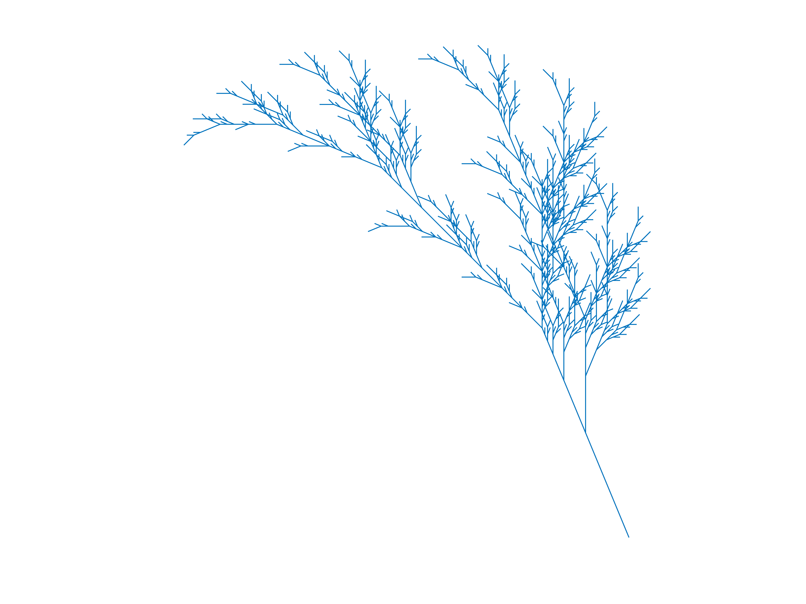

# L-system

A MATLAB script is provided that plots fractal patterns expressed by [L-system](<https://en.wikipedia.org/wiki/L-system>) language. You can customize all of the input arguments in this program to plot any simple fractals supporting L-system language. 

**input arguments**

- ***variables***: a string with a single capitalized letter defines one variable that means "draw forward". Different variables must be split by space. For example, `'F G'` defines two variables; both of them mean "draw forward".
- ***start***: a string that defines the initial pattern. For example `F-G-G` defines a triangle.
- ***rules***: replacement done by each iteration for variables in the string. Different rules must be split up corresponding to the ***variables***. For example `'F-G+F+G-F GG'` defines the replacement `F -> F-G+F+G-F` and `G -> GG`.
- ***angle***: rotation angle in each rotation operation(see below).
- ***iteration***: number of repetitions in the iteration process.

**built-in constants**

- `+`: turn left by ***angle***
- `-`: turn right by ***angle***
- `[`: record current state(position and angle)
- `]`: go back to the nearest recorded state

## Examples

### Fractal tree

*see also [L-System User Notes](<http://paulbourke.net/fractals/lsys/>)*

***variables*** : `'F'` 
***start***: `'++++F'` 
***rules***: `'FF+[+F-F-F]-[-F+F+F]'`
***angle***: `1/8*pi` 
***iteration***: `5`

### Fractal tree with two variables

*see also [L-System User Notes](<http://paulbourke.net/fractals/lsys/>)*

***variables*** : `'F X'` 
***start***: `'+++++X'` 
***rules***: `'FF F-[[X]+X]+F[+FX]-X'`
***angle***: `1/8*pi` 
***iteration***: `6`

### Hilbert curve

*see also [L-Systems in PostScript](<http://www.cs.unh.edu/~charpov/programming-lsystems.html>)*

***variables*** : `'X Y F'` 
***start***: `'X'` 
***rules***: `'-YF+XFX+FY- +XF-YFY-FX+ F'`
***angle***: `1/2*pi` 
***iteration***: `7`

### Dragon curve

*see also [L-System](<https://en.wikipedia.org/wiki/L-system>)*

***variables*** : `'X Y F'` 
***start***: `'FX'` 
***rules***: `'X+YF+ -FX-Y F'`
***angle***: `1/2*pi` 
***iteration***: `10`

